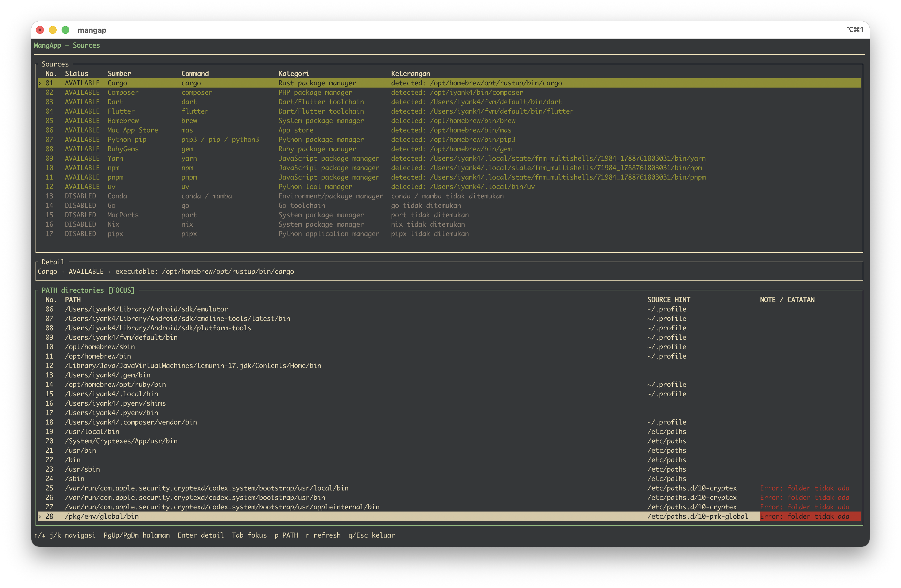

# MangApp - Manage Applications

`mangap` adalah aplikasi terminal MangApp (Manage Applications) yang dibuat khusus untuk MacBook. Aplikasi ini membantu melihat sumber instalasi yang tersedia pada sistem. Aplikasi ini dibuat dengan Rust, Ratatui, dan Crossterm.

## Preview

## Status Fitur

| Fitur | Status |
| --- | --- |
| Nama produk MangApp dan binary `mangap` | Implemented |
| Halaman Sources dengan sumber yang didukung | Implemented |
| Source `AVAILABLE`, `ERROR`, dan `DISABLED` | Implemented |
| Pengurutan source enabled sebelum `DISABLED` | Implemented |
| Panel PATH dengan urutan resolve sistem | Implemented |
| Source hint, duplicate warning, dan missing-path error | Implemented |

Semua source yang didukung selalu ditampilkan. Source yang command-nya tidak tersedia di sistem tetap terlihat sebagai `DISABLED`, sehingga user dapat membedakan antara source yang tidak terpasang dan source yang tidak didukung.

Tabel Sources memiliki kolom `No.` untuk nomor urut visual. Sumber yang enabled ditampilkan lebih dulu, lalu sumber `DISABLED`; masing-masing kelompok tetap diurutkan secara alfabetis.

## Sumber yang didukung (alfabetis)

Daftar berikut diurutkan secara alfabetis berdasarkan nama source.

- Cargo
- Composer
- Conda / Mamba
- Dart
- Flutter
- Go
- Homebrew
- Mac App Store (`mas`)
- MacPorts
- Nix
- npm
- pipx
- pnpm
- Python pip
- RubyGems
- uv
- Yarn

Status yang ditampilkan:

- `AVAILABLE`: command sumber ditemukan pada `PATH`.
- `DISABLED`: command sumber tidak ditemukan, tetapi sumber tetap didukung oleh `MangApp`.
- `ERROR`: pemeriksaan command mengalami error.

## Development

Panduan struktur kode, workflow validasi, cara menambahkan source, dan status progress tersedia di [Panduan Development](docs/how-to/development.md).

Riwayat implementasi Sources tersedia di [History: MangApp Sources](docs/history/2026-09-07-mangapp-sources.md). Backlog aktif dikelola melalui [GitHub Issues](https://github.com/iyank4/mangapp/issues).
